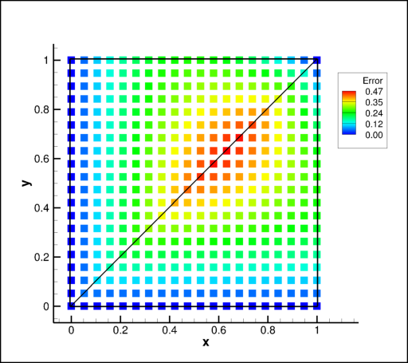

Interpolation Space
-------------------

The STEAM Interpolation Space (or 'IntSpace') is used for flight space interpolation.  Add something about how many dimensions etc. 

These objects are generally part of a database. The 'intspace' attribute of a database is a Python dictionary. The 'keys' of the dictionary are the names of the 'intspace' objects and the 'values' of the dictionary are the 'intspace' objects. While the 'intspace' class has a number of methods, 'intspace' objects are generally created and interfaced with through the database methods 'new_intspace' and 'interpolate'.

Subspaces
~~~~~~~~~

Motivation and Overview
^^^^^^^^^^^^^^^^^^^^^^^

An interpolation space is, at its simplest, a collection if points at unique points in N-space for N independent
patameters.  These points are tessellated using a Delaunay object to fill the space.  However, there are 
cases in which this is not ideal: 

   * If N is large, then it can be prohibitively expensive to create the tessellation.
   * The tessellation can provide biased stencils.
   * The global tessellation can changed based on inclusion/removal of a distant points.
   * For sparse dataset, larger stencils (non-simplex) could provide better representation of the physics.

### FIGURE OF what "REGULAR" means?

To support more flexible interpolation options, STEAM uses a concept of subspaces.  An interpolation space is
'N-D' if it is tesselated with Delaunay in N dimensions.  For a database or collection of points, it could be that
there are N+1 independent parameters but that coverage is square/regular in one dimension.  For such a database,
it can be considerably faster to create N-D databases at each point in the N+1 dimension and linearly interpolate
between the results in the two N-D databases that bound a target point.

Further, in the N+1-D case, it is sometimes desirable to segregate the data in the N-D databases in order to 
create interpolation stencils that are unaware of the final dimension.  This provides an augmented stencil
(2*ND points instead of ND+1 points) and may be preferred.

As an example, if the user has a database where three parameters (Mach, alpha) are populated at several altitudes (h),
then a 3-D database could be made.  Likely, at a point between two altitudes, it would use three points at bounding Mach
and alpha from one altitude and a single point from the other altitude to create the bounding simplex with a four point
stencil.

If, instead, the user could create 2-D databases (Mach/alpha) at each altitude and use linear interpolation between them.
In this case, interpolation at an intermediate altitude would found three points at bounding Mach and alpha and return
those to the one-dimensional interpolator (each 2-D space gives a three point stencil).  The one-dimensional interpolator
would combine those to obtain a six-point stencil at the target point.  If Mach/alpha behaved differently at each
altitude then this "2D+1" interpolation should provide a better answer than the "3D" answer.

As an example, consider 2-D interpolation on the four points below.  The space described by the four points is
interrogated with a fine mesh to provide a suite of results.  Depending on the Delaunay object, there can be
two different tesselations that yield two different interpolants.  If 1-D+1 interpolation is used, the results are
not influenced by tesselation (it is unique) and the larger stencil allows for all four points to influence the
interpolation within the space.  While not superior to an ideal Delaunay triangulation, it is more robust; there is
no method to control the quality of the Delaunay results or guarantee for ideal alignment for all dependent variables.

Edit: Larger stencils can provide better behaved interpolants, especially if a Delaunay triangulation would yield skewed
simplicies or if coverage is coarse.  They tend to provide smoother results and fewer discontinuities. By 
using larger stencils and not relying on simplicies, you can avoid certain ambibuities caused by non-unique
tessellation.  Finally, with square coverage, relying on simplicies frequently results in poor stencil unless
simplex edges line up with contours in the data (see example below).  This is not easilly controlled.

Insert Examples Here

Implementation
^^^^^^^^^^^^^^^^^^^^^^^^

In STEAM, interpolation spaces default to being 'ND' databases, where 'N' is the number of independent parameters.
Any number of parameters can be specified as subvariables.  These subvariables are independent parameters where
coverage is regular.  For each value of the subvariables, a subspace is created that inclues only those database points with
the specified value for that subvariable.  A subspace is an IntSpace object, so it may have subvariables that further
reduce the scope of the interpolation in that subspace.

As an example, consider a database with four independant parameters : ``[mach,alpha,beta,alt]``.  Assume that coverage is square in both
``mach`` and ``alt``.  There are three ways in which an interpolation space could be made for this database:

   1. A '4D' database: using Delaunay triangulation to tessellate the space.
   2. A '3D+1' database: '3D' databases (``[mach,alpha,beta]``) at each value of ``alt``.  Linear interpolation of the 3-D stencils
      between the different subvalues of ``alt`` to the target value.
   3. A '2D+2' database: '2D+1' databases (``[mach,alpha,beta]``) at each value of ``alt`` and '2D' databases (``[alpha,beta]``) at each
      values of ``mach`` (at a given ``alt``). For a target point, stencils at bounding ``alt`` and ``mach`` are obtained in the '2D' databases.
      These are then linearly combined between bounding ``mach`` values at the bounding ``alt`` values.  Finally, the stencils at each ``alt``
      are combined to the target value.

To impliment these strategies, the following would be specified when creating the IntSpace:

   1. ``IntSpace(indep=['mach','alpha','beta','alt'])``
   2. ``IntSpace(indep=['mach','alpha','beta','alt'],subvars=['alt'])``
   3. ``IntSpace(indep=['mach','alpha','beta','alt'],subvars=['alt','mach'])``

Now consider the database in ``[mach,alpha,beta,alt]`` is not square in ``mach`` or ``alt``, but that at each ``mach``/``alt`` point there are
suites of ``alpha`` and ``beta``.  It could not use the 'ND+M' approach outlined above, but you could imagine a 2D space in ``[mach,alt]``
where each point represents a 2D subspace in ``[alpha,beta]``.  For such a database there are two
options for creating the space:

   1. A '4D' database: using Delaunay triangulation to tessellate the space.
   2. A '2D+2D' database: '2D' databases (``[alpha,beta]``) at each combination of ``[mach,alt]``.  For a traget point, the stencil in 
      ``[mach,alt]`` space would identify the subspaces (``[alpha,beta]``) that bound it.  The returned stencil would weight the stencils
      in the subspaces by the stenci in the ``[mach,alt]`` space.

To impliment these strategies, the following would be specified when creating the IntSpace: 

   1. ``IntSpace(indep=['mach','alpha','beta','alt'])``
   2. ``IntSpace(indep=['mach','alpha','beta','alt'],subvars=['alt:mach'])`` **This is not currently supported!**

Examples
~~~~~~~~~~~~~~~~~~~~

Files referenced in this section are collected in the `examples/` directory.  To not clutter 
the installation directory, copy the `examples/` directory and use it as your working directory 
for the following examples.

.. contents:: :local:

Create a database
^^^^^^^^^^^^^^^^^
Since 'intspace' objects are generally created and utilized through database methods, the first step in performing flight space interpolation is the creation of a database. This example shows how to create a very simple database with a single simplex. The solutions in this database each use the same sphere mesh with a diameter of 1.0. The four solutions which define the single simplex of the 3-D database in 'Mach', 'Dynamic Pressure', 'Alpha' space each have a single dependent variable 'pressure' that is constant over the entire spherical mesh. 

This database is then used in the rest of the 'intspace' examples.

.. literalinclude:: ../../examples/scripts/intspace.py
   :caption: Creating a new Database
   :pyobject: database
   :start-after: CODE_START
   :end-before: CODE_END
   :dedent: 4
   :linenos:

.. literalinclude:: ../../examples/scripts/intspace.py
   :caption: Output
   :pyobject: database
   :start-after: OUTPUT
   :end-before: END
   :dedent: 4

Make an interpolation space
^^^^^^^^^^^^^^^^^^^^^^^^^^^^^^^^^^^^^^^
Using the previously created database ('db'), the database method 'new_intspace' can now be used to add an interpolation space, or 'intspace' to the database. An intspace can be thought of as the tessellation of the database points into tetrahedrons. The new intspace is stored in the database attribute 'intspace' with the key 'mqa'.  The default intspace name is 'entire'. The independent parameters are 'Mach', 'qbar', and 'alpha'. Scaling has been set to 'auto', which scales the database to a single unit in each direction to equally weight each dimension. Finally, the independent parameter 'qbar' has the log taken before creating the intspace.  So interpolation within this intspace will be in 'Mach', 'log (qbar)', and 'alpha'.

.. literalinclude:: ../../examples/scripts/intspace.py
   :caption: Creating a new interpolation space
   :pyobject: new_intspace
   :start-after: CODE_START
   :end-before: CODE_END
   :dedent: 4
   :linenos:

.. literalinclude:: ../../examples/scripts/intspace.py
   :caption: Output
   :pyobject: new_intspace
   :start-after: OUTPUT
   :end-before: END
   :dedent: 4

Interpolate
^^^^^^^^^^^^^^^^^^^^^^^^^^^^^^^^^^^^^^^
Interpolation can be performed once an interpolation space has been created for a database. Assuming the requested location falls within the intspace, a new DBPoint is returned.  In the event the requested location falls outside the intspace, nothing is returned. Interpolate requires that each of the independent parameters of the intspace be defined, but these can be defined using a dictionary, or multiple locations can be defined with a dataframe or STEAM table. Since a database can have multiple intspaces the desired intspace must also be defined, though it will default to 'entire' matching the default intspace name in 'new_intspace'.

.. literalinclude:: ../../examples/scripts/intspace.py
   :caption: Interpolating within an intspace
   :pyobject: interpolate
   :start-after: CODE_START
   :end-before: CODE_END
   :dedent: 4
   :linenos:

.. literalinclude:: ../../examples/scripts/intspace.py
   :caption: Output
   :pyobject: interpolate
   :start-after: OUTPUT
   :end-before: END
   :dedent: 4

Get weights
^^^^^^^^^^^^^^^^^^^^^^^^^^^^^^^^^^^^^^^
In the event a new DBPoint with an interpolated solution is not necessary but the user needs to know the interpolation weights necessary for a location within the intspace, the intspace class has a method called get_weights. The method takes a dataframe of locations and return 2 arrays. The first array contains an array for each location with the database nodes that define the simplex the location falls in. The second array contains an array for each location with the interpolation weight that corresponds to each node of the simplex the location fall in.

.. literalinclude:: ../../examples/scripts/intspace.py
   :caption: Get the simplex numbers and interpolation weights
   :pyobject: get_weights
   :start-after: CODE_START
   :end-before: CODE_END
   :dedent: 4
   :linenos:

.. literalinclude:: ../../examples/scripts/intspace.py
   :caption: Output
   :pyobject: get_weights
   :start-after: OUTPUT
   :end-before: END
   :dedent: 4
